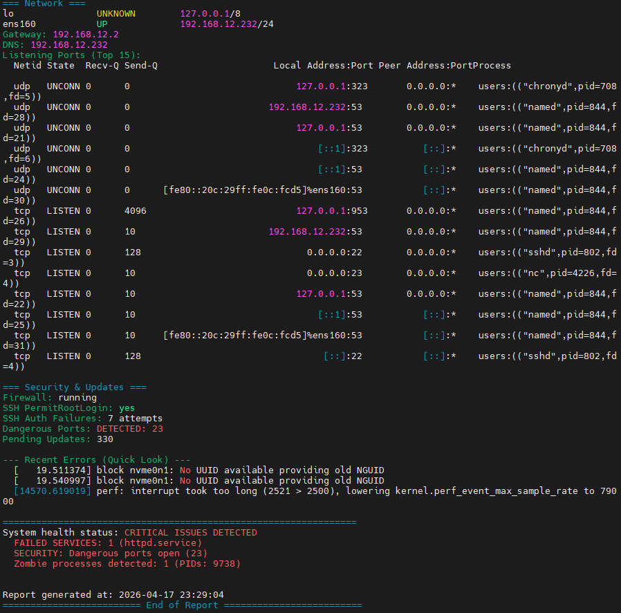
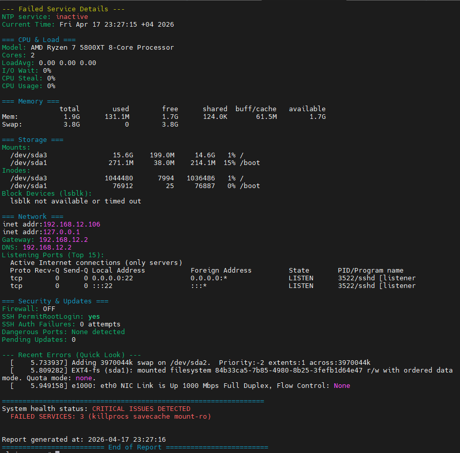
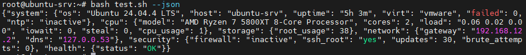
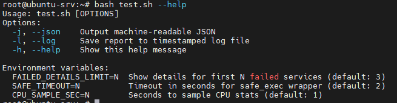
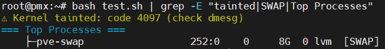
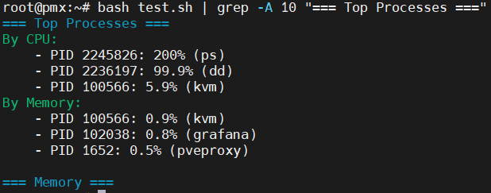

# system-healthcheck (`v0.1.1`)

[](https://opensource.org/licenses/MIT)
[](https://www.gnu.org/software/bash/)
[](https://www.linux.org/)

A lightweight, high-performance Bash script for rapid server audits and health monitoring. Provides a comprehensive "at-a-glance" overview of system resources, network status, and security metrics with support for JSON output and automated logging.

---

## 🔄 Changelog

### v0.1.1 (Current)

#### ✨ New Features

- **SSH Security Tracking**: Reworked SSH failure detection with historical IP analysis, active session monitoring, and automatic alert aggregation
- **Kernel Taint Status**: Detection of tainted kernel state (proprietary modules, OOM, crashes) via `/proc/sys/kernel/tainted`
- **Swap Usage Alert**: Memory pressure warning when swap usage exceeds configurable threshold (default: 50%)
- **Top Processes Overview**: Real-time display of top 3 CPU and memory consuming processes for quick diagnostics

#### 🔧 Improvements

- **Virtualization Detection**: Simplified fallback chain for better compatibility across minimal containers and older kernels
- **Alert Aggregation**: All new checks integrate with `GLOBAL_ALERTS` for unified critical issue reporting
- **JSON Safety**: Added `tainted` field to system JSON output; ensured all new string values are properly escaped
- **Performance**: All new features add <30ms total overhead; zero external dependencies required

#### 🐛 Bug Fixes

- Fixed `Virt:` output showing duplicate lines (`none` + `unknown`) on Proxmox hosts
- Fixed `SSH Auth Failures` appearing twice in output due to legacy code remnants
- Fixed strict IP regex filtering out valid IPv6 addresses in SSH failure logs
- Fixed `json_escape()` not being applied to all dynamic string values in JSON mode

### v0.0.1  (Previous Release)
- CPU Usage % calculation via /proc/stat idle delta
- JSON output mode (--json) for machine-readable reports
- Logging support (--log) for timestamped reports with ANSI codes stripped
- Global alert accumulator for unified issue reporting
- Failed service details (first N units via FAILED_DETAILS_LIMIT)
- Root validation warning (non-blocking EUID check)
- Zombie process PID output
- Strict dangerous port regex (word-boundary matching)

---

## ⚠️ Important: Root Privileges Required

For full data access (disk info, network sockets, security logs), **run with `sudo`**. Script will warn if run without root but allows execution for basic checks.

---

## 🐧 Features

- **System Info**: OS, hostname, kernel, uptime, virtualization detection
- **CPU & Load**: Model, cores, load average, I/O Wait, CPU Steal, CPU Usage %
- **Memory**: RAM and Swap usage
- **Storage**: Mount points, inodes, disk hierarchy
- **Network**: Interfaces, gateway, DNS, listening ports
- **Security**: Firewall status, SSH config, brute-force attempts, dangerous ports
- **Updates**: Pending updates counter (DNF/APT/APK)
- **JSON Output**: `--json` flag for machine-readable reports
- **Logging**: `--log` flag for timestamped reports
- **Kernel Taint Status**: Warns if kernel is tainted (proprietary modules, OOM, crashes)
- **Top Processes**: Real-time overview of top 3 CPU and memory consuming processes
- **SSH Session Tracking**: Historical failed attempts with source IP aggregation + active established sessions
- **Global Alert Aggregator**: Unified critical issue reporting across all sections via `GLOBAL_ALERTS`
- **Logging Support**: Timestamped reports with auto-stripped ANSI codes for clean archival
- **JSON Output Mode**: Machine-readable format for Zabbix, Telegram bots, APIs, or custom parsers

---

## 🖥 OS Compatibility

The script is developed with a focus on POSIX compliance.

### ✅ Verified & Tested:
- **CentOS Stream 9** (systemd)
- **Ubuntu 24.04 Server** (systemd)
- **Debian 12** (systemd)
- **Alpine Linux 3.23.4** (OpenRC)
- Also tested on **Proxmox KVM** and **LXC containers**

---

## 📸 Screenshots

### CentOS Stream 9 - Critical Issues Detected


- *Example: Failed services, dangerous ports, and zombie processes detection*

### Alpine Linux 3.23.4 - OpenRC Support

- *OpenRC compatibility: Service health monitoring on Alpine*

### JSON Output - Machine-Readable Format

- *Parse with jq: `./healthcheck.sh --json | jq '.cpu.cpu_usage'`*

### Help Flag - Usage Documentation

- *Quick reference: `./healthcheck.sh --help`*

### Kernel Taint Status

- *Quick reference: `./healthcheck.sh | grep -E "tainted"`*

### Top Processes 

- *Quick reference: `./healthcheck.sh | grep -A 10 "=== Top Processes =="`*

---

## 🚀 Installation & Usage

### Option 1: Quick Run (One-liner)
```bash
curl -sSL https://raw.githubusercontent.com/capwan/system-healthcheck/main/healthcheck.sh | sudo bash
```

### Option 2 : Manual Setup
```
git clone https://github.com/capwan/system-healthcheck.git
cd system-healthcheck
chmod +x healthcheck.sh
sudo ./healthcheck.sh
```

## Available Flags

| Flag | Description | Example |
|------|-------------|---------|
| `--help`, `-h` | Show usage information | `./healthcheck.sh --help` |
| `--json`, `-j` | Machine-readable JSON output | `./healthcheck.sh --json \| jq .cpu.cpu_usage` |
| `--log`, `-l` | Save timestamped report to file | `./healthcheck.sh --log` |

### Flag Combinations

```
# JSON output saved to log file (colors stripped)
./healthcheck.sh --json --log

# Interactive run with colored output + log file
./healthcheck.sh --log

# Parse JSON output with jq (requires jq installed)
./healthcheck.sh --json | jq '.cpu.cpu_usage'

# Get only critical status from JSON
./healthcheck.sh --json | jq -r '.health.status'
```

### Cron Integration Examples
```
# Run hourly, save logs to /var/log, rotate with logrotate
0 * * * * /usr/local/bin/healthcheck.sh --log >/dev/null 2>&1

# Run daily at midnight, send JSON to webhook (Telegram/Zabbix)
0 0 * * * /usr/local/bin/healthcheck.sh --json | curl -X POST -d @- https://your-webhook-url

# Check for critical issues only, send email alert
0 */6 * * * /usr/local/bin/healthcheck.sh --json | jq -e '.health.status == "CRITICAL"' && mail -s "Server Alert" admin@example.com
```

## ⚙️ Configuration

### Environment Variables
```
# Show details for first 5 failed services instead of default 3
FAILED_DETAILS_LIMIT=5 ./healthcheck.sh

# Increase timeout for slow NFS mounts to 5 seconds
SAFE_TIMEOUT=5 ./healthcheck.sh --log

# Sample CPU stats for 2 seconds (more accurate on fast systems)
CPU_SAMPLE_SEC=2 ./healthcheck.sh --json
```

### Edit Thresholds (in script)

| Variable | Default | Purpose |
|----------|---------|---------|
| `THRESHOLD_DISK` | `90` | Disk usage % that triggers alert |
| `DANGER_PORTS_LIST` | `"21 23 161 3389..."` | Space-separated list of risky ports |
| `THRESHOLD_SWAP` | `50` | Swap usage % that triggers memory pressure alert |
| `FAILED_DETAILS_LIMIT` | `3` | Show details for first N failed services |
| `SAFE_TIMEOUT` | `2` | Timeout in seconds for `safe_exec` wrapper |
| `CPU_SAMPLE_SEC` | `1` | Seconds to sample CPU stats for usage calculation |
-----------------------------

**Report issues:** [GitHub Issues](https://github.com/capwan/system-healthcheck/issues?spm=a2ty_o01.29997173.0.0.482655fbnDgZFa)
