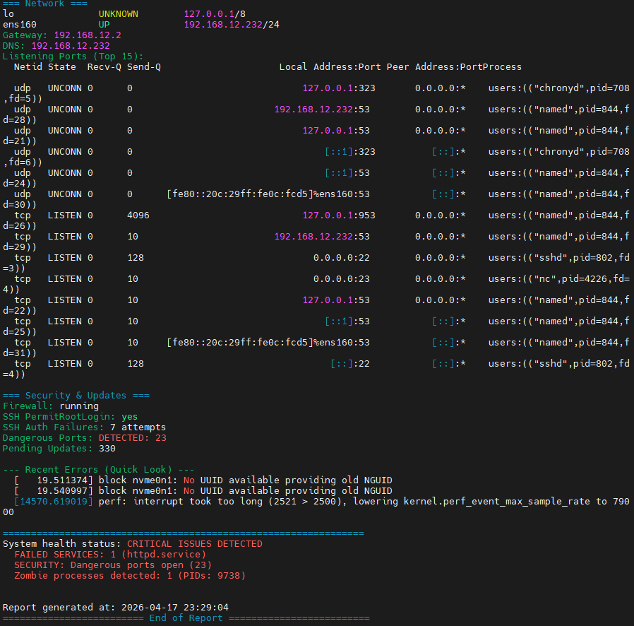
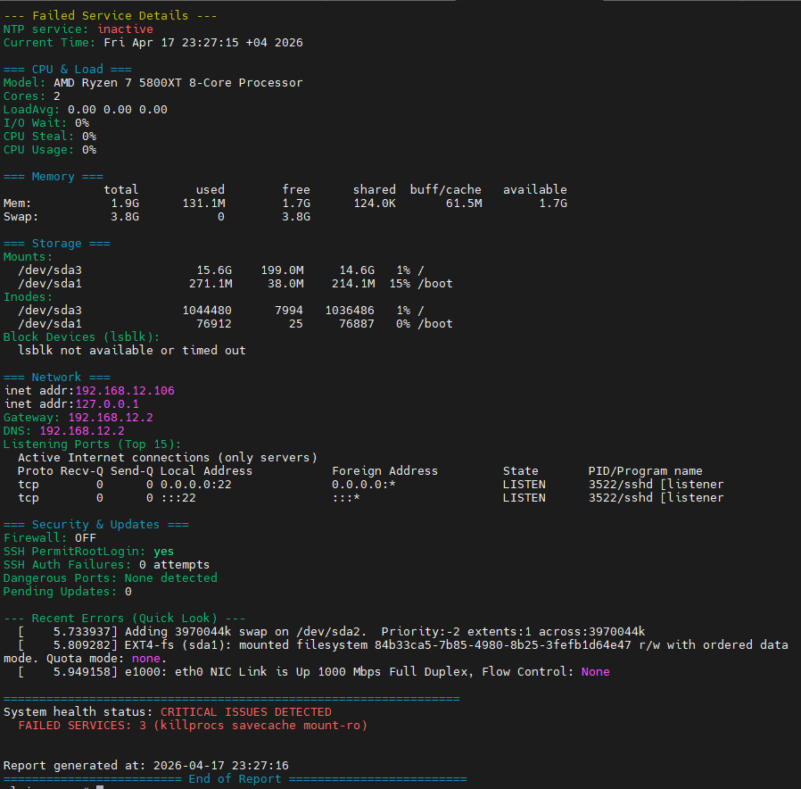
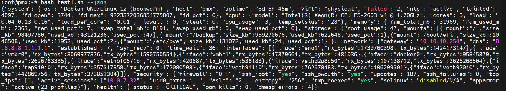
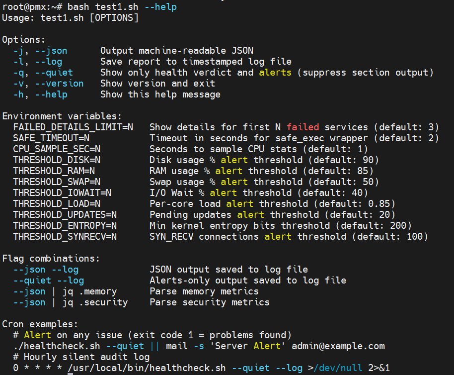
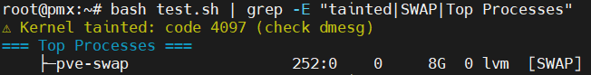
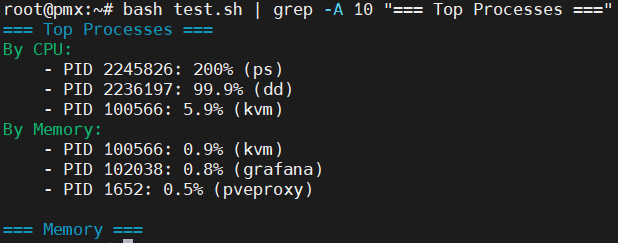

# system-healthcheck (`v0.1.3`)

[](https://opensource.org/licenses/MIT)
[](https://www.gnu.org/software/bash/)
[](https://www.linux.org/)

A lightweight, high-performance Bash script for rapid server audits and health monitoring. Provides a comprehensive "at-a-glance" overview of system resources, network status, and security metrics with support for JSON output and automated logging.

---

## 🔄 Changelog

### v0.1.3 (Current)

#### ✨ New Features

- **CPU Temperature Monitoring**: Reads core temperature from `/sys/class/thermal/thermal_zone0/temp`. Alerts above 85°C. Falls back to `N/A` gracefully in containers and VMs where thermal zones are not exposed. Added to JSON as `cpu.temp_celsius`.
- **TCP Connection State Tracking**: Reports `ESTABLISHED`, `SYN_RECV`, and `TIME_WAIT` connection counts via `ss`/`netstat`. `SYN_RECV` spike triggers alert (possible SYN flood). Configurable via `THRESHOLD_SYNRECV` (default: 100). Added to network JSON.
- **Network RX/TX Totals**: Cumulative per-interface byte counters since boot, sourced from `/proc/net/dev`. Displayed in text mode and as a structured `interfaces[]` array in JSON. No extra sampling delay.
- **User & Privilege Audit** (new Security subsection):
  - Extra UID=0 accounts beyond root detected via `/etc/passwd`
  - Empty/blank passwords detected via `/etc/shadow` (requires root)
  - `sudo`/`wheel` group members listed via `getent group`
  - Last 5 system logins shown via `last -n 5`
- **Kernel Security Parameters** (new Security subsection):
  - **ASLR status** (`/proc/sys/kernel/randomize_va_space`): alerts if disabled (value `0`)
  - **Kernel entropy** (`/proc/sys/kernel/random/entropy_avail`): alerts below `THRESHOLD_ENTROPY` (default: 200 bits); low entropy weakens cryptographic operations
  - **`/tmp` noexec** (`/proc/mounts`): alerts if `/tmp` is mounted without `noexec`
  - **SELinux status** via `/sys/fs/selinux/enforce` (enforcing / permissive / disabled)
  - **AppArmor status** via `/sys/kernel/security/apparmor/profiles` (active + profile count)
- **File Descriptor Usage**: Reads `/proc/sys/fs/file-nr` for open/max FD counts. Alerts when usage exceeds 80%. Added to system JSON as `fd_open`, `fd_max`, `fd_pct`.
- **Inode Exhaustion Detection**: Checks inode usage across all real (`/dev/*`) mount points via `df -i`. Alerts when any filesystem exceeds 90% inode usage. Previously only disk space was tracked; full inodes cause write failures even with free disk space.
- **dmesg Error Count**: Counts kernel messages at `err`, `crit`, `alert`, and `emerg` levels using `dmesg --level`. Falls back to keyword grep on older systems. Alerts if count exceeds 10. Added to JSON as `health.dmesg_errors`.
- **SSH `PasswordAuthentication` Check**: `sshd_config` is now checked for both `PermitRootLogin` (existing) and `PasswordAuthentication` (new). Alerts when password auth is enabled, recommending key-only access.
- **Load Average Alert (finally active)**: `THRESHOLD_LOAD` was defined since v0.0.1 but never triggered an alert. Now computes load per core (`load_1min / nproc`) and alerts when it exceeds the threshold (default: `0.85`). Per-core normalization makes the threshold meaningful across 1-core VPS and 64-core bare-metal equally.
- **`--version` / `-v` flag**: Prints `system-healthcheck vX.Y.Z` and exits cleanly.

#### 🔧 Improvements

- **I/O Wait alert threshold**: `iowait` has been displayed since v0.0.1 but never generated an alert. Now alerts when I/O Wait exceeds `THRESHOLD_IOWAIT` (default: 40%). Configurable via environment variable.
- **RAM usage alert**: `section_memory()` now adds a `GLOBAL_ALERTS` entry when RAM usage exceeds `THRESHOLD_RAM` (default: 85%). Previously only swap had a threshold.
- **NTP alert**: NTP being inactive now triggers an alert. Clock drift causes broken TLS certificates, invalid log timestamps, and Kerberos authentication failures.
- **Pending updates alert**: Update count is now compared against `THRESHOLD_UPDATES` (default: 20). Previously updates were shown but never alerted regardless of count.
- **APK (Alpine Linux) update counting**: `apk list --upgradable` added to the `dnf → apt-get` update chain. Alpine was listed as a supported OS since v0.0.1 but always reported 0 pending updates.
- **`DANGER_PORTS_LIST` expanded** from 9 to 21 ports. Added: `111` (RPC portmapper), `445` (SMB/ransomware), `512/513/514` (rsh/rlogin/rexec), `1433` (MSSQL), `2049` (NFS), `2375` (Docker daemon without TLS — full root exposure), `4444` (Metasploit default), `5984` (CouchDB), `9200` (Elasticsearch), `11211` (Memcached DDoS amplification).
- **Storage JSON expanded**: `storage` object now contains a `mounts[]` array with metrics for every `/dev/*` filesystem (`mount`, `size_kb`, `used_kb`, `used_pct`). Previously only root filesystem usage was reported in JSON.
- **Network JSON expanded**: `network` object now includes `established`, `syn_recv`, `time_wait` connection counts and a structured `interfaces[]` array with per-interface `rx_bytes`/`tx_bytes`. Previously only `gateway` and `dns` were exported.
- **Security JSON expanded**: Added `ssh_pwauth`, `uid0_extra`, `aslr`, `entropy`, `tmp_noexec`, `selinux`, `apparmor` fields.
- **System JSON expanded**: Added `fd_open`, `fd_max`, `fd_pct` fields.
- **CPU JSON expanded**: Added `load_per_core`, `temp_celsius` fields.
- **`--help` updated**: All new flags, all 8 thresholds with defaults, and expanded cron usage examples documented.

#### 🐛 Bug Fixes

- **Fixed duplicate disk alert**: `DISK SPACE LOW` was added to `GLOBAL_ALERTS` twice — once in `section_storage()` (JSON/quiet mode) and again in `check_health_verdict()` (always). Disk check is now consolidated exclusively in `section_storage()` across all modes.
- **Fixed `get_val()` unanchored grep**: `grep "$1" /etc/os-release` could match the key name appearing inside another field's value on non-standard distributions. Changed to `grep "^${1}="` for strict line-start matching.
- **Fixed `THRESHOLD_LOAD` default value**: Changed from `0.9` to `0.85` — the previous value was never tested in practice since the alert logic did not exist.
- **Fixed swap alert location**: Swap check was in `check_health_verdict()`, separated from all other memory logic. Moved to `section_memory()` for consistency. Avoids potential double-check if verdict function is refactored in the future.

### v0.1.2  (Previous Release)
- Quiet Mode Flag: Introduced --quiet/-q to suppress all section output; only the final health verdict with accumulated alerts is displayed. All checks still run in full, making it ideal for cron, monitoring pipelines, and alert-only logging.
- OOM Kill Detection: Scans the kernel ring buffer (dmesg) for Out-of-Memory kills, reports total kill count and the most recent event in GLOBAL_ALERTS, and exports health.oom_kills in JSON.
Memory Metrics in JSON: --json output now includes a structured memory object with RAM and swap metrics from /proc/meminfo (ram_total_mb, ram_used_mb, ram_used_pct, swap_total_mb, swap_used_mb, swap_used_pct). Previously the key was absent.
- Exit Code Reflects Health: Script exits with code 1 when any critical alerts are present and 0 when clean. Enables direct shell integration (./healthcheck.sh || send_alert) while JSON consumers can still use .health.status == "CRITICAL".
- CPU Sample Duration Fix: CPU_SAMPLE_SEC environment variable now correctly controls the sleep interval in section_cpu(); previously it was hardcoded to 1 second despite being documented since v0.0.1.
- Help Documentation Update: --help now covers --quiet, THRESHOLD_DISK, THRESHOLD_SWAP, and flag combination examples.
- Quiet-Mode Alert Fixes: The kernel taint inline warning is no longer printed in --quiet mode, and section_storage() now runs the df check silently to collect disk usage alerts for GLOBAL_ALERTS in all modes.

---

## ⚠️ Important: Root Privileges Required

For full data access (disk info, network sockets, security logs), **run with `sudo`**. Script will warn if run without root but allows execution for basic checks.

---

## 🐧 Features

- **System Info**: OS, hostname, kernel, uptime, virtualization detection
- **CPU & Load**: Model, cores, load average (per-core), I/O Wait (alert threshold), CPU Steal, CPU Usage %, CPU temperature
- **Memory**: RAM and Swap usage with alert thresholds; OOM kill detection
- **Storage**: Mount points, inode usage (exhaustion detection), disk hierarchy with per-filesystem metrics
- **Network**: Interfaces with RX/TX totals, gateway, DNS, listening ports, TCP connection states (SYN flood detection)
- **Security**: Firewall status, SSH config (PermitRootLogin + PasswordAuthentication), brute-force attempts, dangerous ports (21 ports), user privilege audit (extra UID=0, empty passwords, sudo/wheel members, last logins), kernel security parameters (ASLR, entropy, /tmp noexec, SELinux, AppArmor), kernel taint status
- **Updates**: Pending updates counter (DNF/APT/APK) with alert threshold
- **File Descriptors**: Open/max/percentage with alert at >80%
- **Kernel dmesg Errors**: Counts errors/warnings/emergencies from kernel ring buffer; alerts >10
- **Load Average Alert**: Normalised per-core alert threshold (default 0.85)
- **Top Processes**: Real-time overview of top 3 CPU and memory consumers
- **Global Alert Aggregator**: Unified critical issue reporting across all sections via `GLOBAL_ALERTS`
- **JSON Output**: `--json` flag for machine-readable reports with comprehensive structured data
- **Logging**: `--log` flag for timestamped, colour-stripped reports
- **Quiet Mode**: `--quiet` flag for alert-only output (perfect for cron/monitoring)
- **Exit Codes**: Clean exit (0) or critical alert (1) for pipeline integration
- **Version**: `--version` flag prints current version and exits

---

## 🖥 OS Compatibility

The script is developed with a focus on POSIX compliance.

### ✅ Verified & Tested:
- **CentOS Stream 9** (systemd)
- **Ubuntu 24.04 Server** (systemd)
- **Debian 12** (systemd)
- **Alpine Linux 3.23.4** (OpenRC)
- Also tested on **Proxmox KVM** and **LXC containers**

---

## 📸 Screenshots

### CentOS Stream 9 - Critical Issues Detected


- *Example: Failed services, dangerous ports, and zombie processes detection*

### Alpine Linux 3.23.4 - OpenRC Support

- *OpenRC compatibility: Service health monitoring on Alpine*

### JSON Output - Machine-Readable Format

- *Parse with jq: `./healthcheck.sh --json | jq '.cpu.cpu_usage'`*

### Help Flag - Usage Documentation

- *Quick reference: `./healthcheck.sh --help`*

### Kernel Taint Status

- *Quick reference: `./healthcheck.sh | grep -E "tainted"`*

### Top Processes 

- *Quick reference: `./healthcheck.sh | grep -A 10 "=== Top Processes =="`*

---

## 🚀 Installation & Usage

### Option 1: Quick Run (One-liner)
```bash
curl -sSL https://raw.githubusercontent.com/capwan/system-healthcheck/main/healthcheck.sh | sudo bash
```

### Option 2 : Manual Setup
```
git clone https://github.com/capwan/system-healthcheck.git
cd system-healthcheck
chmod +x healthcheck.sh
sudo ./healthcheck.sh
```

## Available Flags

| Flag | Description | Example |
|------|-------------|---------|
| `--help`, `-h` | Show usage information | `./healthcheck.sh --help` |
| `--json`, `-j` | Machine-readable JSON output | `./healthcheck.sh --json \| jq .cpu.cpu_usage` |
| `--log`, `-l` | Save timestamped report to file | `./healthcheck.sh --log` |
| `--quiet`, `-q` | Suppress sections, show only health verdict | `./healthcheck.sh --quiet` |
| `--version`, `-v` | Print version and exit | `./healthcheck.sh --version` |

### Flag Combinations

```
# JSON output saved to log file (colors stripped)
./healthcheck.sh --json --log

# Interactive run with colored output + log file
./healthcheck.sh --log

# Parse JSON output with jq (requires jq installed)
./healthcheck.sh --json | jq '.cpu.cpu_usage'

# Get only critical status from JSON
./healthcheck.sh --json | jq -r '.health.status'

# Quiet mode: only final health summary (ideal for cron)
./healthcheck.sh --quiet

# Get version
./healthcheck.sh --version
```

### Cron Integration Examples
```
# Run hourly, save logs to /var/log, rotate with logrotate
0 * * * * /usr/local/bin/healthcheck.sh --log >/dev/null 2>&1

# Run daily at midnight, send JSON to webhook (Telegram/Zabbix)
0 0 * * * /usr/local/bin/healthcheck.sh --json | curl -X POST -d @- https://your-webhook-url

# Check for critical issues only, send email alert (using quiet mode + exit code)
0 */6 * * * /usr/local/bin/healthcheck.sh --quiet || mail -s "Server Alert" admin@example.com
```

## ⚙️ Configuration

### Environment Variables
```
# Show details for first 5 failed services instead of default 3
FAILED_DETAILS_LIMIT=5 ./healthcheck.sh

# Increase timeout for slow NFS mounts to 5 seconds
SAFE_TIMEOUT=5 ./healthcheck.sh --log

# Sample CPU stats for 2 seconds (more accurate on fast systems)
CPU_SAMPLE_SEC=2 ./healthcheck.sh --json

# Custom thresholds (all can be set as environment variables)
THRESHOLD_SYNRECV=200 THRESHOLD_ENTROPY=256 THRESHOLD_LOAD=1.0 ./healthcheck.sh
```

### Edit Thresholds (in script)

| Variable | Default | Purpose |
|----------|---------|---------|
| `THRESHOLD_DISK` | `90` | Disk usage % that triggers alert 
| `THRESHOLD_SWAP` | `50` | Swap usage % that triggers memory pressure alert 
| `THRESHOLD_RAM` | `85` | RAM usage % that triggers alert 
| `THRESHOLD_IOWAIT` | `40` | I/O Wait % that triggers alert 
| `THRESHOLD_LOAD` | `0.85` | Per-core load average threshold
| `THRESHOLD_SYNRECV` | `100` | SYN_RECV count that triggers possible flood alert
| `THRESHOLD_ENTROPY` | `200` | Minimum available entropy (bits) before alert
| `THRESHOLD_UPDATES` | `20` | Pending update count that triggers alert
| `DANGER_PORTS_LIST` | `"21 23 111 161 445 512 513 514 1433 2049 2375 3389 4444 5984 9200 11211"` | Space-separated list of risky ports |
| `FAILED_DETAILS_LIMIT` | `3` | Show details for first N failed services |
| `SAFE_TIMEOUT` | `2` | Timeout in seconds for `safe_exec` wrapper |
| `CPU_SAMPLE_SEC` | `1` | Seconds to sample CPU stats for usage calculation |
-----------------------------

**Report issues:** [GitHub Issues](https://github.com/capwan/system-healthcheck/issues?spm=a2ty_o01.29997173.0.0.482655fbnDgZFa)
